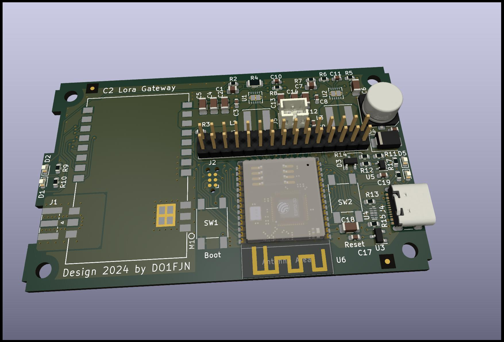

# C2LoRaGW Hardware

## Prototyp 1 Board (PT01)

### Issues

ZRXE125 polarity wrong. Part needs to be "upside down" or 180° rotated. An additional capacitor is placed on R11 to
prevent fast switch on/off at the exact trigger voltage.

The 3.3VCC supply drops below APX809S31SA trigger level, if a sudden load happen on 5V rail (turning it on or transmit)
only if the input voltage is in the range between 3.8V - 3.3V (some mV above 3.3V output).

Main TPS63000 is fixed to "power save mode" - not the best decision.

### Sheet and Layout

[Sheet PDF](C2LoRaGW_sheet_PT01.pdf)

[Board Layout](C2LoRaGW_pcbtop_PT01.pdf)

## Full-Duplex Relay-Addon (FDR01)

This addon is in planning stage.

tbd
